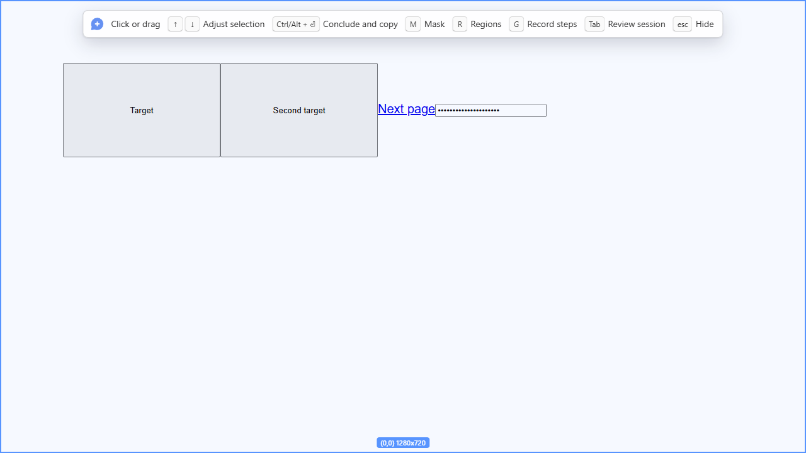
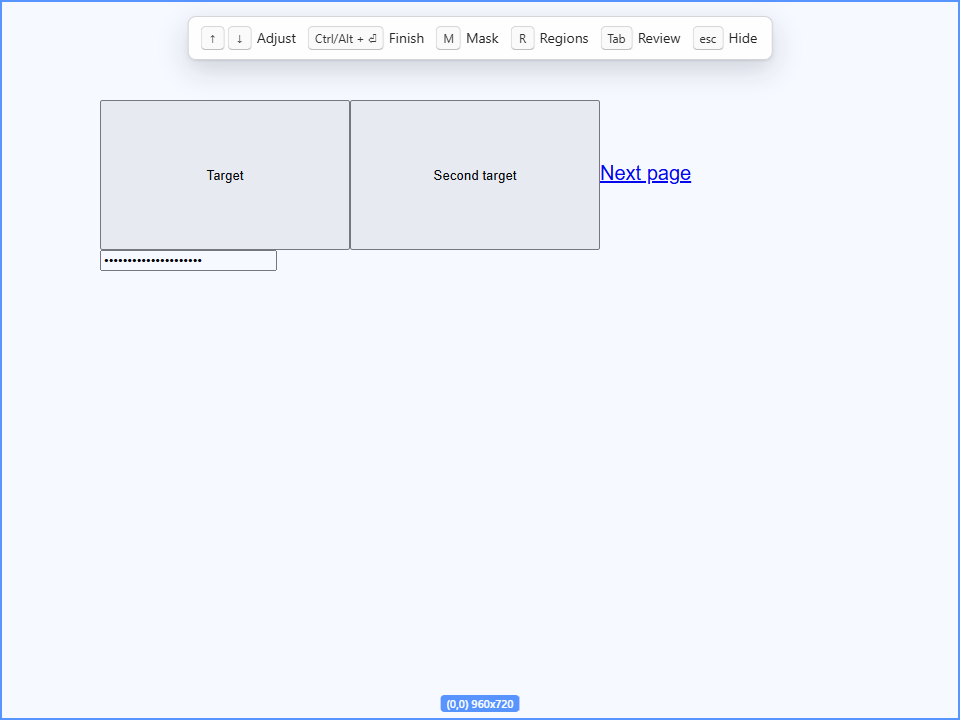
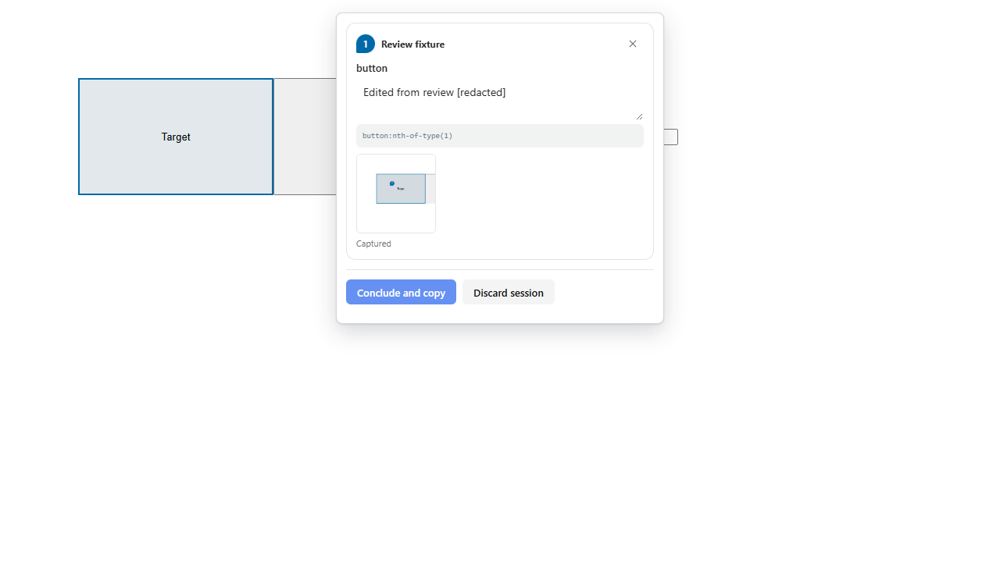
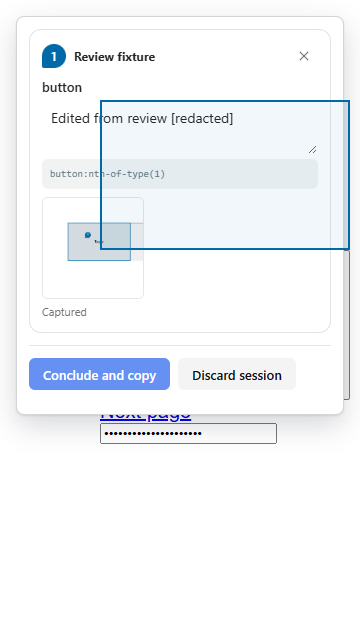
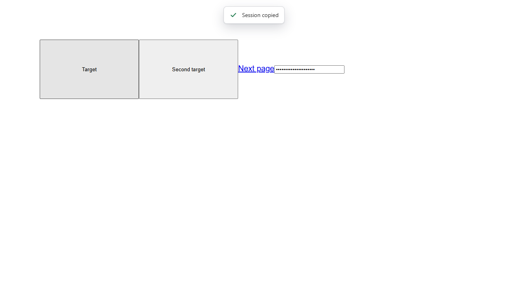
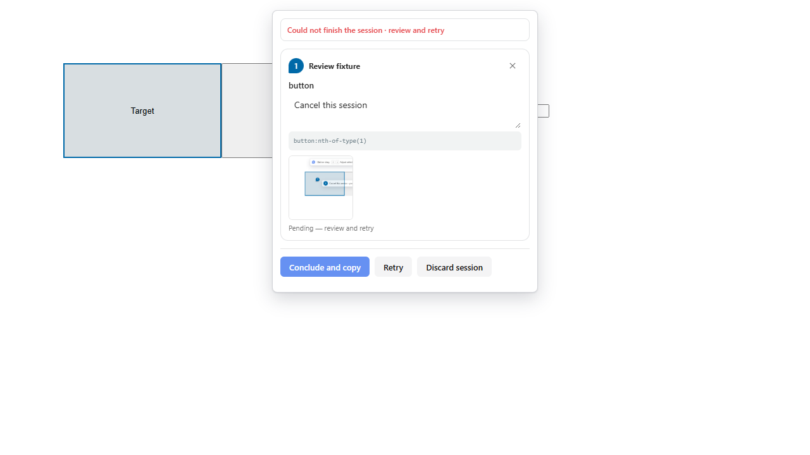
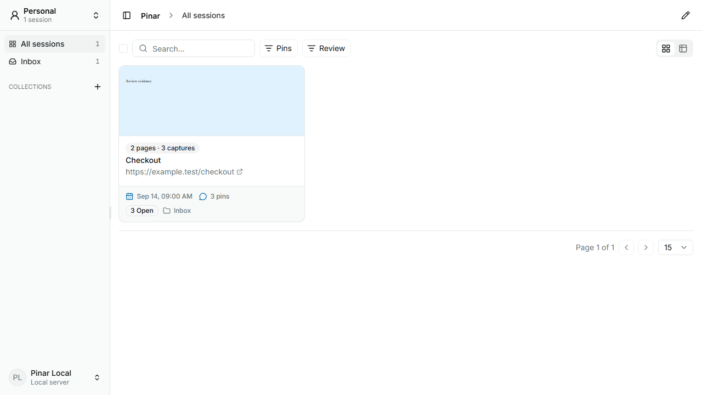
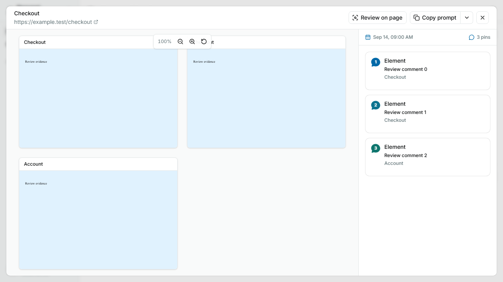

# Validar a sessão contínua

## Esconder, cancelar e concluir

- **Revisar sessão:** pressione Tab durante a captura, conforme indicado na toolbar. A revisão substitui a toolbar. Os cards opacos mostram número, página, elemento/região, path e miniatura. Edite o comentário diretamente; ele é salvo ao sair do campo. O X remove a anotação. O texto Capturado confirma o salvamento; falhas ficam pendentes para nova tentativa. Ao descartar a sessão, aparece a confirmação de cancelamento. Não existe minimização, logo flutuante, atalho V ou opção de revisão no menu da extensão.
- **Ocultar tudo:** pressione Esc sem um comentário em edição. A toolbar permanece oculta ao navegar para outras páginas ou janelas. Reabra somente pelo ícone da extensão ou Alt+Shift+P. A sessão e os pins salvos permanecem.
- **Cancelar um comentário ainda não salvo:** use Cancelar no editor ou Esc. Se estiver no modo de máscaras, Esc primeiro sai desse modo.
- **Descartar a sessão ativa:** abra a revisão com Tab e escolha **Descartar sessão** para remover suas evidências; se a exclusão falhar, ela permanece pendente para nova tentativa. A toolbar não repete o contador do ícone da extensão.
- **Voltar da revisão:** pressione Tab novamente ou Esc. Não há botão de voltar. A revisão substitui a toolbar e usa o cursor normal; nunca ficam duas barras sobre a página.
- **Seleção sem obstrução:** a toolbar expandida fica transparente sob o ponteiro, liberando a página por baixo. Não existem mais as opções fixa/auto-hide ou o atalho H. Tab mantém a navegação normal entre campos no editor de comentários.
- **Larguras menores:** os rótulos usam uma palavra até 1180px; até 1000px, a logo e “Clique ou arraste” saem. Em telas ainda menores, dicas secundárias saem progressivamente, preservando os atalhos principais.
- **Concluir e copiar:** Ctrl/⌘+Enter durante a captura, ou o botão no painel de revisão. O sucesso mostra **Sessão salva**; uma falha informa que a sessão não pôde ser concluída e mantém as evidências para revisão e nova tentativa. Não há um segundo atalho global configurável para essa ação.
- **Cancelar sessão pelo menu da extensão:** Alt+Shift+X, por padrão. Encerra sem copiar e conserva o histórico; não equivale a descartar as evidências na revisão.

Os atalhos globais podem ser alterados no navegador. Cada pin recebe sua própria screenshot quando a captura de imagens está habilitada. Uma sessão reúne essas evidências, inclusive diferentes estados da mesma página; não existe uma única imagem que substitua todas elas.

O idioma escolhido na aplicação é sincronizado com os itens próprios do Pinar no menu da extensão. Os itens nativos (remover extensão, permissões etc.) seguem o idioma do navegador. Após atualizar a extensão, recarregue também a página da aplicação para ativar a ponte de idioma.

## Screenshots do fluxo validado

A revisão substitui a toolbar, usando os mesmos controles do editor de comentários:

Ao concluir, a extensão confirma o resultado antes de desaparecer. Se houver falha, o aviso permanece no painel de revisão junto das ações de tentar novamente ou descartar.

Imagens produzidas pelo teste E2E com dados de exemplo. A primeira mostra a sessão no histórico; a segunda mostra todas as imagens no pan/zoom e todas as anotações no painel direito.

## Roteiro local e remoto

Faça o roteiro nos modos Local e Remoto. No remoto, use o ambiente de validação com a nova versão do servidor e aceite os documentos atuais nas opções da extensão.

Validação automatizada isolada: `bun run test:e2e:session`. Ela inicia e encerra um servidor de testes com histórico próprio. Os testes da extensão carregam MV3 e capturam pixels reais, substituindo apenas o transporte; `apps/server/src/server/continuous-session.contract.test.ts` verifica os serviços reais local e remoto, incluindo acesso privado.

1. Abra o Pinar em uma página, escreva um comentário e salve com Enter. A sessão começa automaticamente.
2. Adicione outro pin. Use Esc para navegar sem excluir as anotações.
3. Abra outra página, adicione um pin e confira a indicação no ícone da extensão.
   A numeração continua na sessão: depois dos pins 1 e 2, o próximo será 3, inclusive em outra aba. Excluir um pin não renumera os restantes nem reutiliza seu número. Screenshots e cópia mantêm o número atribuído; evidências antigas não são reescritas.
4. Experimente dois estados da mesma URL, como um modal aberto e fechado. Cada pin deve conservar sua própria evidência.
5. Pressione Tab durante a captura para revisar a sessão. Remova uma anotação e confirme que ela sai também da página.
6. Conclua com Ctrl/⌘+Enter. Cole o resultado: os comentários de todas as páginas devem aparecer, cada um com captureId, pinId e screenshot correspondente.
7. Abra o histórico: haverá uma sessão. Clique nela para abrir diretamente o modal com todas as imagens no mesmo pan/zoom e todas as anotações no painel direito. Não há carrossel. Selecione uma anotação: sua imagem será centralizada e destacada, e os detalhes abertos. Copiar, mover e excluir no modal operam sobre a sessão completa.
8. Repita interrompendo a conexão com o servidor depois da primeira captura. O rascunho deve ficar pendente. Restaure a conexão e tente novamente, sem precisar revisitar as páginas cujas screenshots já foram obtidas.
9. Feche/reabra a extensão com um rascunho pendente. A revisão deve recuperar as anotações.
10. Teste Cancelar sessão e Descartar sessão separadamente: a primeira ação encerra sem copiar e conserva o histórico; a segunda remove suas evidências.

Uma screenshot que não chegou a ser obtida não pode reconstruir o estado antigo por URL. Nessa situação, o comentário permanece na revisão para ser recriado na página original. O destino e a identidade da sessão ficam fixados para impedir que uma tentativa posterior envie dados para outra conta.

A persistência mantém identificadores e endpoints legados de batch apenas por compatibilidade interna; o produto expõe uma sessão contínua, sem slots ou modo de captura em lotes. A cópia privada usa `/api/batches/:id/markdown`, com autenticação no remoto e a proteção local habitual. `/b/:id.md` continua reservado aos links públicos já suportados; copiar uma sessão não a publica.
