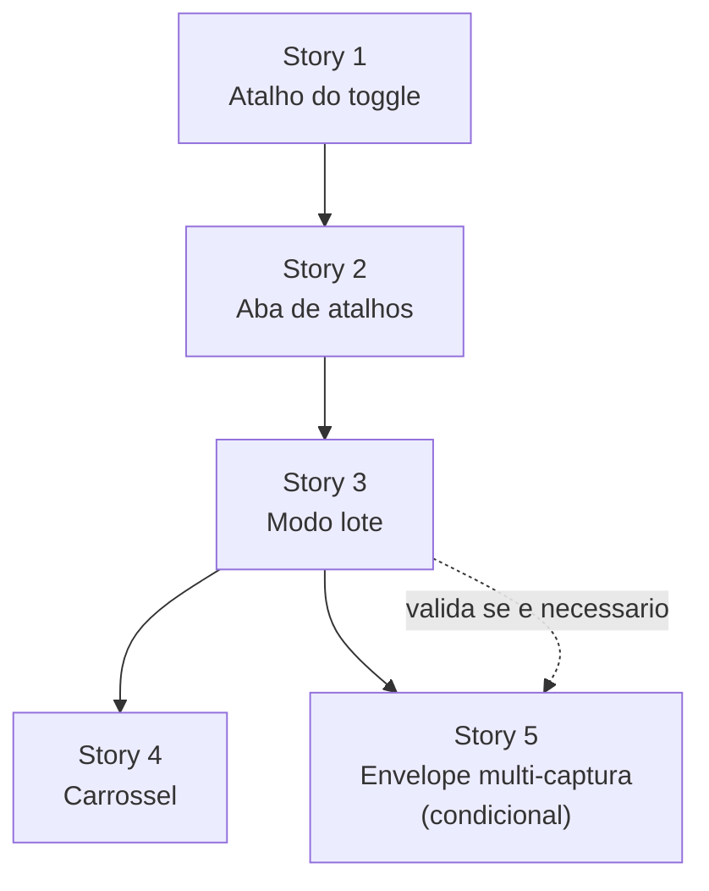

# Epic: Atalhos configuráveis e captura em lote

**Origin:** conversa de produto — 2026-09-01 (sem intake formal)

## Traceability
- Prototype routes/screens: —
- Business rules: —
- Source docs: `AGENTS.md` (contrato de paste, `captureId`/`pinId`), `apps/server/src/lib/help-locales/en.ts` (artigos `shortcuts-and-navigation`, `organize-projects`, `sharing-links`)

## Context

- **Macro problema:** a extensão não expõe nenhum atalho configurável, e capturas de páginas diferentes não podem ser agrupadas em uma entrega única para o agente.
- **Objetivo da iniciativa:** dar controle de teclado ao usuário e permitir acumular anotações de várias páginas em um lote coeso, sem inventar uma terceira entidade de armazenamento.
- **Resultado esperado:** esconder/mostrar a toolbar por teclado; revisar um fluxo multi-página e entregar tudo de uma vez ao agente.
- **Restrições e premissas:**
  - `captureId` e `pinId` nunca são reescritos (`AGENTS.md`).
  - Uma sessão está amarrada a uma URL, um screenshot e os locators daquele DOM. Achatar páginas em um registro quebraria reopen, relocate e review por página.
  - O modelo de dados já suporta agregação: `Session.collectionId`, `ProjectTreeCollection { sessions }`, `resolveDestination`, `moveSession`, `reorderSessions`.
  - `VisualCapture` é single-capture por construção: `parseVisualCapture` lança `missing_capture_id`.

### AS-IS

- `extension/manifest.json` não tem bloco `commands`. Nenhum atalho é sugerido nem redefinível com tecla padrão.
- Esconder a toolbar só acontece por clique no ícone: `chrome.action.onClicked` (`background.js:95-100`) re-injeta `CONTENT_INJECTION_FILES` e `content.js:2-5` chama `globalThis.__pinarToggle()`.
- Teclas do overlay são fixas em `content.js`: `Escape`, `Mod+Enter`, `m`, `ArrowUp`/`ArrowDown`, `Enter`. O overlay suprime `keydown`/`keyup` via `ownedKeyCodes` para a página não reagir.
- Cada `Mod+Enter` fecha uma captura de uma página e gera uma sessão independente.
- O destino (`CaptureDestination { collectionId, projectId }`) já persiste entre capturas via `storeDestination`, mas isso não é visível como "lote" em lugar nenhum.
- O agregado `/c/{id}` e a projeção `/c/{id}.md` já listam cada sessão com pins, DOM path e selector — como lista vertical.

### TO-BE

- O toggle da toolbar tem tecla padrão e aparece em `chrome://extensions/shortcuts`, onde o usuário redefine.
- Existe um modo lote explícito: destino travado, contador visível, cada `Mod+Enter` acumula em vez de encerrar.
- Finalizar o lote é uma ação própria, com atalho próprio.
- O lote é uma coleção existente — uma sessão por página, ordem preservada por `reorderSessions`.
- A visualização agregada apresenta o lote como carrossel/galeria.

### Out of scope

- Redefinir as teclas de dentro do overlay (`Escape`, `m`, setas, `Enter`). Exige UI de configuração, storage, detecção de conflito com a página e tratamento de layout de teclado — projeto separado.
- Criar uma entidade "batch" no servidor.
- Alterar a semântica de `Escape`. Ela permanece exatamente como hoje e é **escopada à página corrente**: cancela rascunho ou máscara; sem rascunho, limpa os pins e esconde a toolbar daquela página. O estado do lote vive na extensão, não na página, então `Escape` nunca o alcança — descartar um lote é ação explícita e separada.

## Story backlog

### Story 1: Atalho padrão para alternar a toolbar
**Size:** small | **Status:** [x] Concluída | **Depends on:** —

**Objective:** dar tecla padrão e superfície de rebinding ao toggle que já existe, sem criar comando paralelo.

**Acceptance criteria:**
- [x] `manifest.json` declara `commands._execute_action.suggested_key`.
- [x] Nenhum comando novo duplica o toggle.
- [x] O atalho alterna a toolbar sem cancelar a sessão nem perder pins.
- [x] O artigo `shortcuts-and-navigation` documenta o atalho nos 7 idiomas.

---

### Story 2: Aba de atalhos nas opções
**Size:** medium | **Status:** [x] Concluída | **Depends on:** Story 1

**Objective:** reunir num só lugar o atalho do navegador, com o binding em vigor, e as teclas fixas do overlay.

**Acceptance criteria:**
- [x] Nova aba "Atalhos" nas opções da extensão.
- [x] Atalho do navegador lido de `chrome.commands.getAll()`, refletindo rebinding do usuário.
- [x] Botão que abre `chrome://extensions/shortcuts`.
- [x] Teclas do overlay listadas como fixas, com o motivo.
- [x] Rótulos nos 7 idiomas.

---

### Story 3: Modo lote na captura
**Size:** large | **Status:** [ ] Não iniciada | **Depends on:** Story 2

**Objective:** acumular capturas de várias páginas em uma coleção, com estado visível e finalização explícita.

**Acceptance criteria:**
- [ ] Modo lote liga/desliga, trava o destino e sobrevive à navegação entre páginas.
- [ ] Com lote ativo, `Mod+Enter` adiciona à fila; sem lote, comportamento atual intacto.
- [ ] Contador de itens visível na toolbar.
- [ ] Comando `finish-batch` registrado em `commands`, com finalização também disponível por clique.
- [ ] Cada página vira uma sessão com o mesmo `collectionId`; `captureId` e `pinId` preservados.
- [ ] Falha de upload de um item não descarta o lote inteiro.

---

### Story 4: Carrossel do lote na visualização agregada
**Size:** medium | **Status:** [ ] Não iniciada | **Depends on:** Story 3

**Objective:** apresentar a coleção como galeria navegável em vez de lista vertical.

**Acceptance criteria:**
- [ ] `/c/{id}` oferece navegação item a item, com teclado e indicador de posição.
- [ ] A ordem respeita `reorderSessions`.
- [ ] `Copy Markdown` continua entregando `/c/{id}.md` completo.
- [ ] Sem regressão de acessibilidade na listagem existente.

---

### Story 5: Envelope multi-captura no paste
**Size:** medium | **Status:** [ ] Não iniciada | **Depends on:** Story 3

**Objective:** permitir colar um lote inteiro em um agente preservando os N `captureId`.

**Acceptance criteria:**
- [ ] Formato definido e versionado (`schemaVersion`), sem reescrever ids.
- [ ] Parser aceita o envelope novo e o formato atual.
- [ ] Consumidor antigo degrada de forma previsível.
- [ ] Só é iniciada se a Story 3 provar que `/c/{id}.md` não basta.

## Epic roadmap

**Caminho crítico:** Story 1 → Story 2 → Story 3. Stories 4 e 5 partem da 3 e podem correr em paralelo.

**Validações intermediárias:**
- Depois da Story 1: atalho aparece e rebinda em `chrome://extensions/shortcuts`.
- Depois da Story 2: lote de 3 páginas produz 3 sessões na mesma coleção, e `/c/{id}.md` já entrega tudo.
- Depois da Story 3: decidir com uso real se a Story 4 se justifica.

## Epic acceptance criteria

- [ ] Alternar a toolbar por teclado, sem cancelar a sessão.
- [ ] Atalhos redefiníveis pelo usuário sem tela de configuração própria.
- [ ] Anotar 3 páginas em sequência e obter uma entrega única, com os pins de cada página preservados.
- [ ] Nenhuma entidade nova no servidor; o lote é uma coleção.
- [ ] `captureId` e `pinId` idênticos aos originais em todo o fluxo.
- [ ] `bun run typecheck` e `bun run test` verdes.

## Open questions

| Questão | Proposta padrão | Impacto se decidida diferente |
|---|---|---|
| `Mod+Enter` em modo lote: adiciona à fila ou continua encerrando? | Adiciona à fila enquanto o lote está ativo; finalizar é comando separado | Se mantiver o encerramento, "adicionar à fila" precisa de tecla nova e o modo lote perde a fluidez |
| Tecla padrão do toggle | `Alt+Shift+P` nas duas plataformas | Só muda o default; o rebinding é do usuário de qualquer forma |
| Lote atravessa janelas do browser? | Não — escopo por janela | Escopo global exige reconciliar destino entre janelas |

## Risks

| Risco | Mitigação |
|---|---|
| Bifurcar `Mod+Enter` quebra memória muscular de quem não usa lote | Comportamento atual é o default; o fork só existe com lote explicitamente ativo |
| Comandos do Chrome não disparam em `chrome://`, Web Store e antes da injeção | Documentar no artigo de atalhos; o clique no ícone continua funcionando |
| Chrome limita a 4 comandos com tecla sugerida | Só duas entradas previstas: `_execute_action` e `finish-batch` |
| Estado do lote perdido ao navegar ou ao service worker hibernar | Persistir em `chrome.storage.session`, não em memória do worker |
| Upload parcial: N páginas, N verificações de cota (`canStoreBytes`) | Falha por item não descarta o lote; item fica pendente e re-tentável |
| Envelope multi-captura quebra consumidores externos | Versionar por `schemaVersion` e manter o formato atual aceito |

## Recommended next step

- `/agile-story` para detalhar a Story 1
